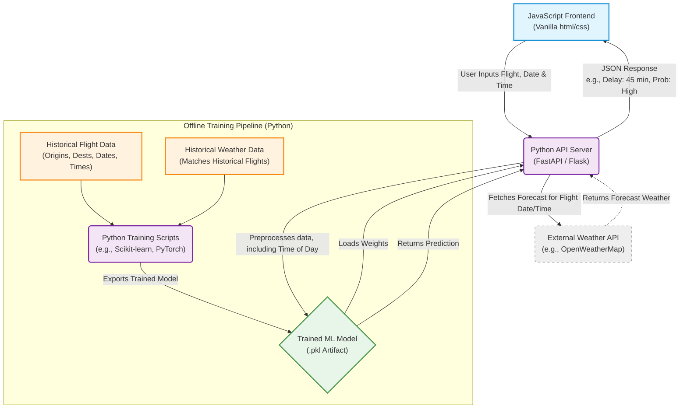

# flight-forecast
CIS360 FA2026 group project

## Proposal

## Flight Entry
Users manually enter the details for a flight arriving at Denver International Airport (DEN). The app uses these inputs to estimate the likelihood of an arrival delay based on historical flight data.

| Form label | Example | Historical data field |
|---|---|---|
| Carrier Code | UA | `Carrier Code` |
| Date | 10/15/2026 | `Date (MM/DD/YYYY)` |
| Flight Number | 123 | `Flight Number` |
| Tail Number | N123UA | `Tail Number` |
| Origin Airport | ORD | `Origin Airport` |
| Scheduled Arrival Time | 4:10 PM | `Scheduled Arrival Time` |
| Actual Arrival Time | 4:45 PM | `Actual Arrival Time` |
| Scheduled Elapsed Time (Minutes) | 160 | `Scheduled Elapsed Time (Minutes)` |
| Actual Elapsed Time (Minutes) | 175 | `Actual Elapsed Time (Minutes)` |
| Arrival Delay (Minutes) | 15 | `Arrival Delay (Minutes)` |
| Wheels-on Time | 4:05 PM | `Wheels-on Time` |
| Taxi-In Time (Minutes) | 10 | `Taxi-In time (Minutes)` |
| Delay Carrier (Minutes) | 5 | `Delay Carrier (Minutes)` |
| Delay Weather (Minutes) | 0 | `Delay Weather (Minutes)` |
| Delay National Aviation System (Minutes) | 8 | `Delay National Aviation System (Minutes)` |
| Delay Security (Minutes) | 0 | `Delay Security (Minutes)` |
| Delay Late Aircraft Arrival (Minutes) | 2 | `Delay Late Aircraft Arrival (Minutes)` |

Prediction: Likelihood that the flight arrives at DEN at least 15 minutes late, based on historical patterns in the dataset.

The app does not look up or verify the flight's current status. Its result is a historical delay estimate, not a live flight update.

## Anticipated Deliverables
1. Python model training
   - Clean and prepare historical flight and weather data.
   - Train a basic machine learning model to predict delay-related outcomes.

2. Model artifact export (.pkl)
   - Save the trained model in a format that can be used by the backend.

3. Backend server
   - Create API endpoints to send user data to the model and return predictions.

4. Frontend application
   - Build a simple form where users enter airline, airport, and day information.
   - Send the request to the backend and display the result.

5. End-to-end project package
   - Combine the model, backend, and frontend into one working project.
   - Include a Docker setup for easier use.

## Project Scope
- Use historical flight and weather data to study factors related to delays.
- Clearly define requirements before coding.
- Keep documentation updated throughout the project.
- Divide work based on team skills and availability.
- Communicate regularly and address issues early.
- Test the model, backend, and frontend together.

## Data Sources
- Historical flight data from BTS or similar sources.
- Weather data matched to corresponding dates and times.
- Features such as airline, airport, time of day, and weather conditions.

## Planned Development Phases
1. Requirements and scoping
   - Define the project goals and expected results.
   - Review available data and technical constraints.

2. Data preparation
   - Clean and merge historical datasets.
   - Prepare features for model training.

3. Model training and evaluation
   - Train a baseline model and compare results.
   - Adjust the approach based on performance.

4. Backend development
   - Build API endpoints.
   - Connect the API to the trained model.

5. Frontend development
   - Create a simple input form and result display.
   - Test communication with the backend.

6. Final checks
   - Add Docker support if needed.
   - Run basic end-to-end testing.

## Related Documentation
- [backend/README.md](backend/README.md)
- [frontend/README.md](frontend/README.md)
- [model/README.md](model/README.md)

