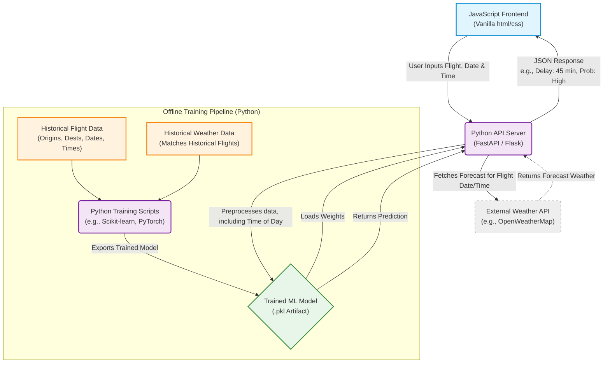

# flight-forecast
CIS360 FA2026 group project

## Proposal

```mermaid
graph TD
    %% Define styles for clarity and color consistency
    classDef frontend fill:#e1f5fe,stroke:#0288d1,stroke-width:2px;
    classDef backend fill:#f3e5f5,stroke:#7b1fa2,stroke-width:2px;
    classDef model fill:#e8f5e9,stroke:#388e3c,stroke-width:2px;
    classDef data fill:#fff3e0,stroke:#f57c00,stroke-width:2px;
    classDef external fill:#eee,stroke:#999,stroke-width:1px,stroke-dasharray: 5 5;

    %% --- Online Serving (User Flow) ---

    A["JavaScript Frontend<br/>(Vanilla html/css)"]:::frontend -->|User Inputs Flight, Date & Time| B
    
    B("Python API Server<br/>(FastAPI / Flask)"):::backend -->|Fetches Forecast for Flight Date/Time| E
    
    E("External Weather API<br/>(e.g., OpenWeatherMap)"):::external -.->|Returns Forecast Weather| B
    
    B --->|Preprocesses data, including Time of Day| D
    
    D{"Trained ML Model<br/>(.pkl Artifact)"}:::model --->|Loads Weights| B
    
    D --->|Returns Prediction| B
    B --->|JSON Response<br/>e.g., Delay: 45 min, Prob: High| A
    
    %% --- Offline Training Pipeline ---

    subgraph "Offline Training Pipeline (Python)"
        F["Historical Flight Data<br/>(Origins, Dests, Dates, Times)"]:::data
        G["Historical Weather Data<br/>(Matches Historical Flights)"]:::data
        H("Python Training Scripts<br/>(e.g., Scikit-learn, PyTorch)"):::backend
        F --> H
        G --> H
        H -->|Exports Trained Model| D
    end
```
